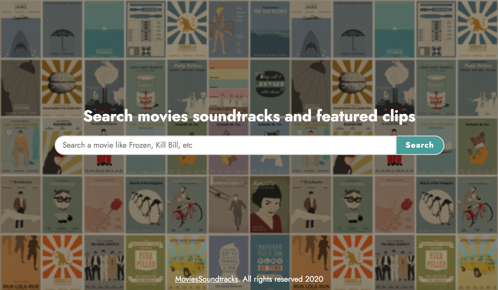
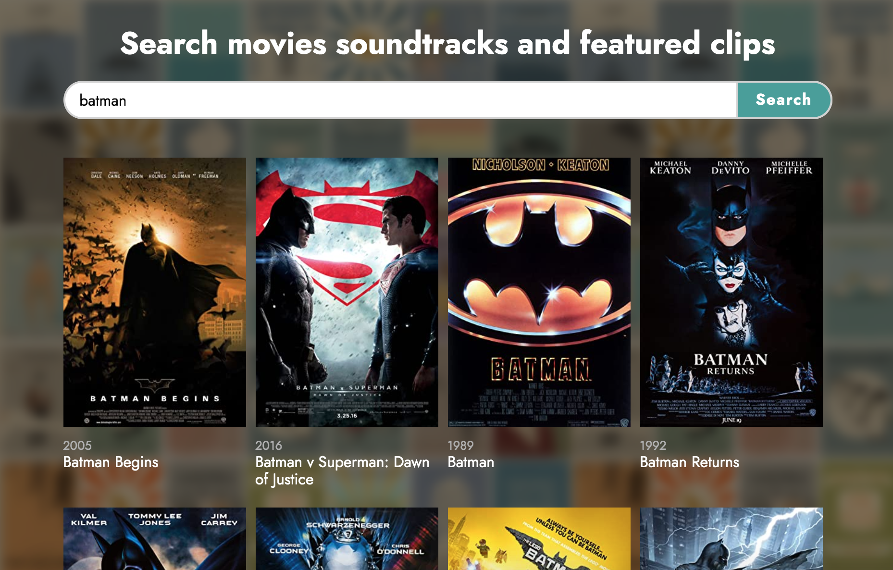
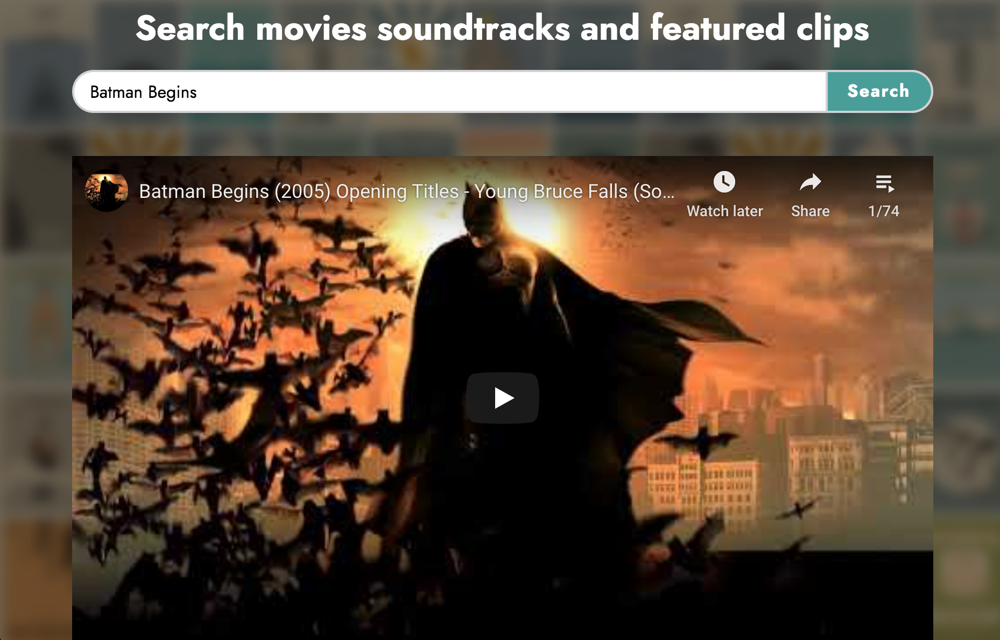
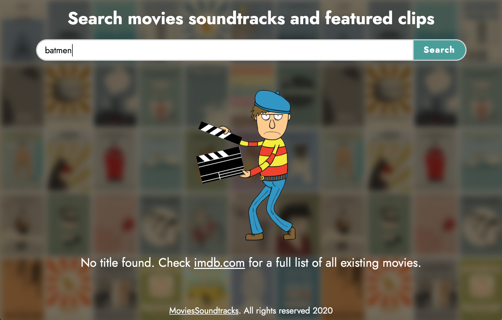

# MovieSoundtracks

## Summary
A movie soundtrack database that takes the cinematography world to a different level. Inspired by the exciting soundtracks featured in Quentin Tarantino's films, users can search and listen to soundtracks playlists for free (hosted on YouTube).

## Features

* API Integration: Search movie titles from IMDB and fetch top playlists from YouTube
* Responsive Design: Compatible with phones, tablets and large screens
* URL and input field will update based on current movie selection for easy sharing

## Screenshots

Home:

Results:

Playlist:

Error:

## Technologies

* HTML
* CSS
* JavaScript
* JQuery

## Demo

- [Live Demo](https://santiagogomezl.github.io/movies-soundtracks/)
